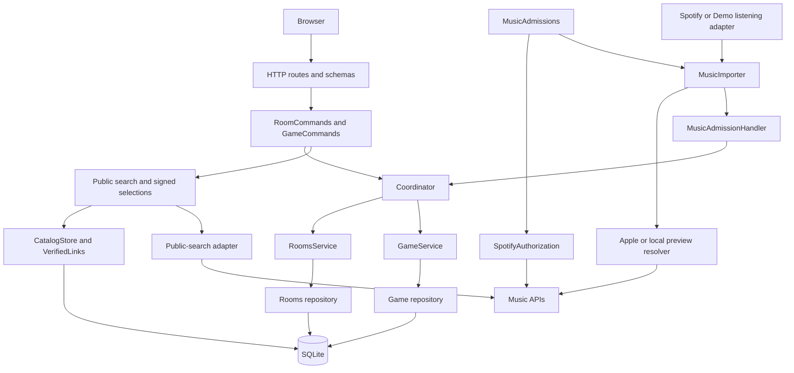

# 05 — Architecture

The application is a modular monolith: one Python process, two business domains (**Rooms** and **Game**), and one SQLite database. The browser uses native JavaScript modules. See the [data model](06_DATA_MODEL.md), [API contract](07_API_AND_RUNTIME.md) and [codebase map](09_CODEBASE_MAP.md).

## Responsibilities and dependencies

| Component | Responsibility |
|---|---|
| HTTP (`backend/api/`) | Request validation, cookies, Origin checks, rate limits and response mapping |
| `RoomCommands` / `GameCommands` | Authorized use cases, signed selections and domain orchestration |
| `Coordinator` | Room command ordering, server acceptance time, transactions and lifecycle reconciliation |
| Rooms | Admission, identity, presence, private listening pools and snapshot export |
| Game | Frozen roster and songs, candidate planning, readiness, timed phases, scoring and rankings |
| Public catalog | Metadata search, query/preview caches, verified identity links and signed selections |
| Music adapters | Listening evidence, provider authorization and verified preview resolution |
| Browser application | Session state, transport, screen lifecycle and automatic readiness |
| Host audio | Audio unlock, tab lease, preload/decode, waveform extraction and scheduled playback |

`backend/app.py:create_app` constructs and injects these components. Repositories own SQL; services receive connections so one application transaction can span Rooms and Game. Selection and scoring use frozen values with injected clock/random dependencies.

## Command ordering and room lifecycle

Each protected operation acquires its room lock, captures server acceptance time, authenticates the player and applies due transitions. Due transitions commit before a stale or invalid command is rejected, so requests cannot postpone deadline closure. The operation then uses a short read or write context. Different rooms have independent locks; SQLite serializes writes.

`RoomLocks` keeps one reentrant lock while a room has holders or queued waiters, then removes the idle entry. Cleanup uses the same lock. Provider requests run outside room locks and database transactions.

Start freezes the roster, settings, song facts and familiarity, and marks the room playing atomically. Game uses that snapshot throughout the match. Catalog reseeding leaves room copies and historical results intact. New identities join only in the lobby.

## Music admission and the public catalog

`MusicSource` returns `ListeningData(provider, evidence, songs, account_id)`. Spotify supplies personal top/recent observations; Demo supplies simulated assignments. `MusicImporter` resolves checked previews and independent decoys. `MusicAdmissionHandler` delivers the result into Rooms, rechecking lobby state, nickname, capacity and account constraints before committing.

Rooms validates evidence against room mode and hashes personal account identity with the room and provider. Checked songs provide playable media; observations preserve ownership with their preview URLs stripped. A compatible later import can attach checked audio while keeping earlier listeners. Spotify is the implemented personal connector. Apple supplies public search, preview matching and chart decoys; Apple personal listening is planned.

Demo metadata and media come from a pinned pack. Installation and attribution are documented in [catalog setup](../catalog/README.md). Startup validates an installed pack; an absent pack leaves Demo disabled while configured Real admission remains available. The launcher prepares missing media before starting the server.

Public search uses shared metadata independently of hidden room pools. The application supplies permitted Demo values; the catalog has no access to private listener tables. Bulk metadata selections may require provider verification before signing. Submission and scoring use authenticated frozen facts without provider calls.

Verified links are scoped by provider/storefront and purpose (`guess` or `recording`) and stored in both directions. Fingerprints include the matching-rule version. Positive links survive restarts until identity changes or explicit rejection; query results and temporary preview references expire separately.

Game's `guess_title` allows recognized release suffixes for song guesses. Catalog's `recording_title` retains those distinctions for playback and listener ownership. The exact matching and scoring rules are in [Game Rules](03_GAME_RULES.md#4-scoring).

## Pattern rationale and course connection

The listening adapters translate provider data into the common `MusicSource` interface (**Adapter**). Injecting the selected source provides **Strategy** composition. `MusicImporter` provides a narrow **Facade** over source reads, preview checks and decoy resolution. `PreviewResolver` caches and controls expensive resolution, similar to a caching **Proxy**; it also enriches recording facts, which extends its role beyond that pattern.

These boundaries follow the course's Software Design Patterns slides 19–31 (Adapter, Proxy, Facade), 39–42 (Strategy), and SOLID slides 3/15: source reading, authorization and membership delivery have separate responsibilities. A new personal connector implements the source and authorization contracts and is wired at the composition root. [Source contract tests](../tests/integration/test_music_source_contract.py), [source units](../tests/unit/test_music_sources.py) and [connection lifecycle tests](../tests/integration/test_music_connection_lifecycle.py) cover those boundaries.

## Browser readiness and host audio

`frontend/app.mjs` composes state, actions, transport, polling, readiness, audio and screens. Screens render server projections and emit commands. Stable DOM/SVG nodes preserve controls across polls; result helpers display server scores.

Music admission handles connection drafts, polling, cancellation and session delivery. Authorization strategies validate provider redirects. Provider choices come from server capabilities. The [music connection contract](07_API_AND_RUNTIME.md#12-real-music-connection-runtime) defines delivery and acknowledgement races.

Current-round readiness is automatic for every participant. Guests need current state; the host also needs a decoded clip, running audio context and active lease. Audio and readiness work are fenced by session and generation so delayed responses cannot update a later room. One host device plays the shared audio; the other devices submit guesses and see results.

## Phase and failure ownership

`GameService` owns commands and timed transitions. The coordinator calls `advance` and reconciles room state in the same transaction. The loop is setup → ready → countdown → answering → reveal → leaderboard. [Game Rules](03_GAME_RULES.md#1-game-and-round-flow) defines timers and recovery.

The full candidate plan is decoded during setup. At closure, Game stages the next candidate separately in `game_round_preparations`. Browsers prepare during reveal and leaderboard; promotion carries fresh participant check-ins into the next round. Complete preparation enters the normal countdown, while missing check-ins use the ready gate. The [readiness contract](07_API_AND_RUNTIME.md#6-automatic-readiness-and-synchronization) defines freshness and host-lease checks.

Host presence and audio ownership are separate. Leave, expiry and restart abort interrupted games with partial rankings; revealed scores remain final. Rooms owns presence, Game owns results, and coordination joins their lifecycle atomically.

## Storage, runtime and verification

Rooms, Game and the public catalog share `DATA_DIR/whos_on_repeat.sqlite3` with separate table ownership. The [data model](06_DATA_MODEL.md) describes relationships and schema versions.

Run one worker: room locks, audio leases, music receipts, settings and query budgets are process-local. Startup applies migrations and initializes recovery/catalog state. A one-second task advances deadlines; periodic cleanup enforces retention. Blocking database and provider work runs outside the async event loop.

Verification combines policy units, SQLite/HTTP integration, frontend lifecycle tests and device playtests. Commands and coverage are in [README](../README.md); test responsibilities are in [the testing strategy](18_TESTING_STRATEGY.md). Provider experiments are recorded in [the PoC](04_POC.md).
