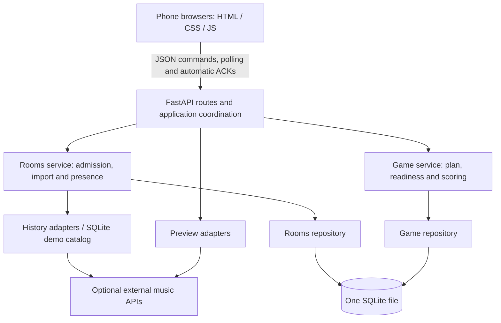

# 05 — Architecture

Date: 2026-10-01. This checkpoint prepares the Demo backend independently of
the game frontend. The earlier `feature/demo-core` checkpoint retains its
temporary UI; real provider integration and optional all-device audio remain
target design.
See [implementation status](08_IMPLEMENTATION_STATUS.md) for current evidence.
The PoC source stays on `POC`; its findings inform this design without proving
production readiness. [07_API_AND_RUNTIME.md](07_API_AND_RUNTIME.md) defines the
browser, command and runtime contract; [06_DATA_MODEL.md](06_DATA_MODEL.md)
defines persistence.

## 1. Evidence and first milestone

Apple developer-token catalog lookup, ISRC matching, previews and charts worked
in the PoC. Personal Apple listening history remains unverified. Spotify
supplied personal songs with Apple-resolved previews, but unique-song counts
and preview coverage were not retained. The two-device room worked over LAN;
its start-time drift was not retained. See [04_POC.md](04_POC.md).

The first milestone is a three-browser demo game with shared audio from the
host device. The host also guesses and sees the same game as every player;
there is no required central display. Only the host has administrative controls.
Real imports need a selected, validated provider and familiarity mapping.
All-device audio remains conditional on audible playback and timing acceptance.

## 2. Ownership and data flow

| Component | Owns | Boundary |
|---|---|---|
| Rooms | Room mode/code, admission, room-specific browser credentials, host membership, nickname/character, provider authorization and imports, shared songs and familiarity, demo catalog, presence | Returns values through its service; does not select rounds or score answers |
| Game | Frozen roster/settings/song facts, complete round plan and reserves, readiness generations, deadlines, options, answers, scores, reveals and rankings | Receives snapshots; does not query Rooms tables or hold provider credentials |
| Application coordination | Authorization, room command ordering, cross-domain lifecycle transactions, provider work and runtime tasks | Calls narrow domain interfaces; repositories retain table ownership |
| Audio adapters | Preview resolution and metadata enrichment | Return playable candidates or unavailable; do not determine listeners or scores |
| Browser | Phase presentation, automatic acknowledgements, estimated server-clock offset, host playback | Server remains authoritative for identity, phase and scoring |

The target deployment uses one server process for the API, catalog assets and
frontend. This backend checkpoint serves the API and `/static/demo` catalog
assets; it contains no game frontend. A future browser client polls every 500 ms
in active lobby/game views with no overlapping requests. Heartbeats are separate,
every five seconds. This is a design choice, not a demonstrated capacity result:
20 rooms × 10 players × 2 polls/second means about 400 state requests/second.
Final rankings remain visible; active game polling stops when the game ends.

## 3. Admission and lobby preparation

The host chooses **normal** or **demo** at room creation, before anyone joins.
Normal requires verified personal music authorization for every player, including
the host, before admission. Imported songs are prepared automatically in the
lobby; Start stays disabled until required imports/checks finish. Demo explicitly
bypasses provider authorization and assigns hidden random fixtures from the
seeded SQLite `demo_catalog`, including local clips and optional covers.
Import failure never silently changes a normal room into demo mode.

The backend imports each player's candidates using that player's authorization.
The host's account does not expose other players' histories. Candidate-list
sources/counts and the first real provider remain pending; enough unique songs
are needed for the complete requested game, wrong options and replacements.
Import once per lobby pool build, not once per round. Membership changes can
require a new build. Players neither inspect nor manually choose the song pool.

Rooms deduplicates within each room and stores familiarity on each player–song
relationship. Provider secrets stay outside snapshots, SQLite song/game data and
browser-visible responses; transient personal authorization is discarded after
its required import. Provider calls have bounded timeouts/concurrency and run
outside SQLite transactions. Lobby responses expose nicknames, character IDs,
connection/import readiness, counts and settings, never songs or listener maps.

## 4. The boundary at Start

Start checks the host identity, room revision, player limits, mode readiness and
settings. In a short transaction it locks room membership/imports, creates a
`preparing` game and copies the starting roster, including nickname and
`character_id`. Starting player identities remain eligible throughout the game;
new identities cannot join until the room returns to the lobby.

The application passes Game a value snapshot: room ID/revision/host, roster,
shared song identity/title/display artists/structured artist IDs/ISRC, optional
artwork, preview facts and each listener's familiarity. Game receives no Rooms
connection or user token. Repositories participate in shared local transactions
without querying one another's domain tables.

Setup prepares the full requested sequence and checked reserves. Each original
requested slot allows its initial candidate and up to three distinct substitutes
across setup and later recovery. Exhausted slots are skipped. Cancel if
`skipped_original_slots / requested_round_count > 0.30`; exactly 30% is allowed.
Never change the denominator after skipping. Announce the actual playable count;
original slot numbers remain stable and the surviving decoy proportion can differ.
Unique candidates and four distinct options are checked before play. Freeze the
validated song snapshot/plan at preparation completion; mutable readiness and
attempt state are stored separately. No normal provider lookup occurs per round.

The five-second setup countdown is a minimum presentation period, not an import
or network guarantee. Continue showing preparation if needed. The host preloads
all planned audio and checked reserves during setup. Other browsers receive only
the current round's public data. The host audio controller needs private future
playback references for preloading; these references can reveal provider metadata
and do not offer secrecy against a participant inspecting their own browser.
Never include future song labels, correct markers or listener mappings in public
payloads. See the API contract for this trust limit.

## 5. Preview and artwork adapters

| Interface | Returns |
|---|---|
| History import | Normalized identities, credited artist identities, source-list signals and optional artwork |
| Preview resolution | Playable URL/source or unavailable, optionally artwork/credited artist metadata from the resolved catalog entry |
| Demo catalog | Fixture songs, familiarity assignments, stable artist IDs and local asset references |

The proposed real preview chain is Apple by ISRC, then iTunes by title/artist,
then Deezer by ISRC. Missing configured catalog credentials skip that adapter;
missing mandatory personal authorization blocks normal admission. Apple charts
can supply real decoys; demo uses its fixture pool. Real adapter capabilities,
terms and browser playback need validation before integration.

Artwork is a reference, not image bytes in SQLite. The Apple adapter resolves
`attributes.artwork.url` `{w}`/`{h}` placeholders to 300 each. Game freezes optional
imported artwork or preview-match enrichment, including decoys, without writing
Rooms tables. The reveal contract uses the snapshot and requires a frontend
placeholder if the image is absent/broken; it makes no catalog request and never
changes scoring. This backend checkpoint stores and exposes optional artwork
references and serves the bundled demo cover. Placeholder rendering belongs to
the future frontend.

Future provider integration must wire explicit adapters from configuration at
application composition. Avoid a shared mutable provider singleton or a general
music service owning unrelated concerns; no real-provider adapter is included in
this backend checkpoint.

## 6. Game phase and failure ownership

The normal loop is `setup` (minimum 5 s) → `ready` (automatic check-ins) →
`countdown` (3 s) → `answering` (10/20/30 s, or all starting players submit) →
`reveal` (5 s) → `leaderboard` (5 s) → next `ready`. The final leaderboard stays.
There is no routine host Next action.

Game scopes ACKs to attempt and readiness generation. State versions order
browser updates; another player’s ACK does not invalidate an ACK. Initially
all starting players must ACK within ten seconds; timeout aborts preparation and
returns everyone to the lobby with affected nicknames. A later timeout keeps the
same unstarted attempt and offers host Retry (new ten-second generation) or
Continue without named unready players **from the barrier only**. Their roster,
score and answer eligibility remain. The host's audio readiness is mandatory.

Once required ACKs arrive, Game publishes a common future `starts_at_ms`; clients
estimate clock offset. ACKs prove state readiness, not audible playback or exact
synchronization. Server ordering/time govern answer acceptance and scoring.
During play, all screens show each nickname/character and Listening/Submitted
status, separate from connectivity; guesses stay hidden until reveal.

| Failure | Required behavior |
|---|---|
| Import fails | Report it; normal mode stays normal and cannot start while required imports are incomplete |
| Setup exceeds five seconds | Show preparation; never start an unchecked sequence |
| Initial readiness timeout | Abort setup, return lobby, name missing ACK players |
| Later readiness timeout | Host Retry or Continue; no unstarted answer/score is created |
| Playback fails before closure | Retain answers, mark attempt `void`, exclude points; use only checked frozen reserves and the original slot's remaining replacement budget |
| Cumulative skips exceed 30% | Abort with a clear cause; preserve labelled partial results if play began |
| Failure report after reveal | Reject; revealed results are final |
| Artwork unavailable | Placeholder; continue |
| Non-host disconnects | Preserve identity/answers; missing submission earns zero at deadline |
| Host disconnects | Current timed round can close; wait before next readiness window; expire after 60 s from last accepted heartbeat |
| Host explicitly leaves | Abort immediately; save labelled partial rankings |
| Server restarts | Void interrupted unclosed attempts, abort preparing/playing games, preserve revealed scores, restore surviving rooms to lobby |

Host refresh restores its identity but can interrupt shared audio. One active
host audio-controller lease prevents competing tabs. Prechecking cannot eliminate
browser rejection/network/device failures; void handling remains necessary.
Neither a readiness exclusion nor a stale heartbeat bypasses host audio or the
60-second grace. Host transfer is excluded in v1.

An in-process lifespan task advances deadlines/phases and checks presence even
without polls. Requests enforce expiry before accepting commands/heartbeats.
Close/score atomically once; retained `void` answers never contribute to rankings.

## 7. Module placement and runtime

| Area | Purpose |
|---|---|
| `backend/app.py`, `backend/core/` | Dependency wiring, configuration, health and lifespan |
| `backend/api/` | HTTP routes, strict request schemas, origin checks, cookies and rate limits |
| `backend/application/` | Per-room mutation ordering, authorization, cross-domain transactions and audio leases |
| `backend/rooms/` | Admission/credentials, membership/characters, presence, demo fixtures and repository |
| `backend/game/` | Preparation/selection, readiness/phases, pure scoring and Game repository |
| `backend/storage/` | SQLite connections and versioned schema migrations |
| `catalog/` | Runtime Demo metadata, bundled clips/cover and provenance; real-song population remains pending |
| Future frontend | Phase rendering, polling, ACKs, clock estimates and host audio; excluded from this checkpoint |
| `tests/unit/`, `tests/integration/`, `tests/support/` | Pure rules, actual service/persistence paths and isolated fixture helpers |
| `tools/` | Optional development and capacity probes |

See [the codebase map](09_CODEBASE_MAP.md) for concrete module ownership and
change locations. The backend boundaries are implemented; frontend presentation
and provider adapters remain separate future work. Both feature
domains persist their own data. Deploy one worker/replica with SQLite on a
persistent compatible local volume under `DATA_DIR`; do not run a second writer
process. Offload synchronous database work from the async event loop. Enable
foreign keys and a busy timeout per connection. WAL requires compatible storage;
validate the selected Azure volume before enabling it. Backups must preserve a
consistent database including WAL contents. Provider calls never hold room locks
or transactions across network waits.

## 8. Acceptance and remaining decisions

Verify pure scoring plus real service paths: partial artist credit, empty
submitted Nobody versus missing blank, stale ACKs/retries, deadlines/closure races,
immutable snapshots, strict 30% arithmetic, shared replacement budgets, host
lease/grace and final reveal immutability. Verify rollback/startup/retention and
both domains' persistence. Browser checks must exercise three players through a
full demo game, preloading, automatic check-ins/phases, character/status rendering,
readiness recovery, audio failure, reconnect and cover fallback. Load-test the
400-polls/second scenario and measure the defined readiness/start target.

The executable migration matches the schema. Automated application evidence
and remaining browser/load acceptance gates are recorded in the implementation status. Real import provider/familiarity/quantity policy and all-device audio
remain independent gates. See [07_API_AND_RUNTIME.md](07_API_AND_RUNTIME.md) for
commands, timings, security and operational acceptance.
