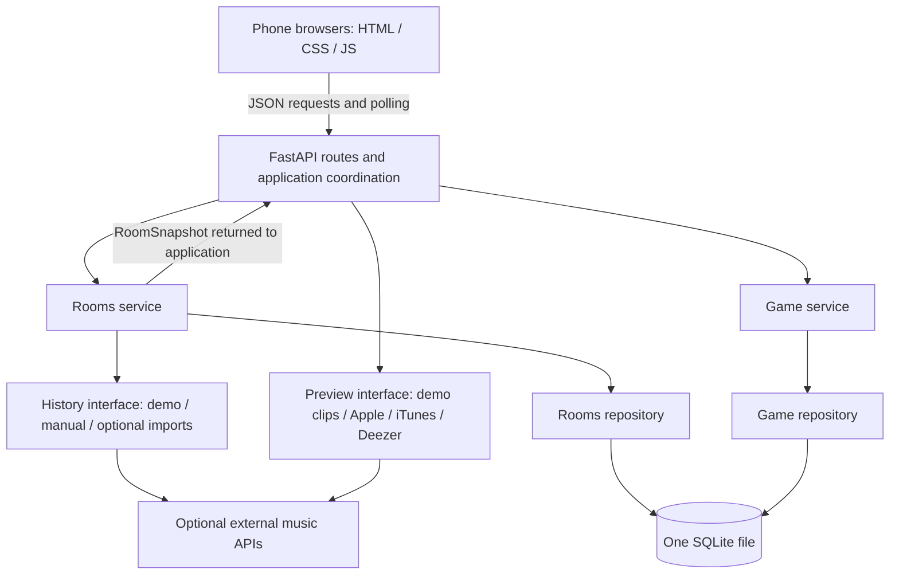

# 05 — Architecture

Date: 2026-09-29. High-level design for the app we will build from scratch.
The PoC source stays on `POC`; only its findings inform this design. The
diagram below describes the target structure, not an implemented application.

## 1. What the PoC changes

- Apple developer-token access worked for catalog search, ISRC matching,
  previews and charts. It does not grant personal listening-history access.
- Apple personal history is unverified because the available account could
  not obtain a Music User Token without a subscription.
- Spotify supplied personal songs and Apple-resolved previews played in the
  browser. The unique-song count and preview coverage were not retained.
- The two-device room worked after enabling LAN access. Its start-time drift
  was not retained, so synchronized playback has no quantitative acceptance yet.

The first playable milestone uses demo/manual songs and host-device audio.
Apple history, Spotify import and all-device audio remain conditional additions.
History import and preview delivery therefore have separate interfaces.
See [the PoC results](04_POC.md#question-outcomes) for the evidence and limits.

## 2. Two feature domains

| Domain | Owns | Does not own |
|---|---|---|
| **Rooms** | Room codes, host/player membership, player identification, song lists, per-player familiarity, imports and lobby song counts | Round selection, guesses, scoring and game results |
| **Game** | Game settings, game snapshots, round selection, answer options, deadlines, guesses, scoring, reveals and rankings | Player identity, live membership edits and personal-history imports |

Each domain has a narrow service interface and its own SQLite persistence
code. A room can have several past games. Rooms history pages obtain those
results through Game's public service, without querying Game's tables.
Rooms maps imported source lists/manual tags to familiarity. Game applies the
scoring and selection rules in [03_GAME_RULES.md](03_GAME_RULES.md).

## 3. Target architecture

Everything except the browsers and external APIs runs in one process. The same
process serves the frontend. Use plain HTML/CSS/JavaScript and JSON polling
every 500 ms while in a lobby or game; stop polling after the game ends.
Polling is simpler than WebSockets for this scale. Its responsiveness and the
20-room target still need verification; the diagram is not a capacity result.

## 4. The boundary at game start

The application calls `rooms.service.get_room_snapshot(room_id)`, then gives
the snapshot to Game. The snapshot is an immutable value containing:

- Room ID, room revision and host player ID.
- Player IDs and nicknames.
- Song identity, title and artist, with each player's familiarity level.
- The listener IDs for each song, including shared songs.

The application resolves preview candidates before starting scored rounds and
passes those results separately. Game persists the snapshot facts it needs for
rounds and scoring. Later imports cannot change the listeners or difficulty of
an active game. Game receives values, not a database connection to Rooms or a
provider token. Returning players are identified by Rooms before a command
reaches Game; host-only commands are checked on the server.

Provider calls stay outside SQLite transactions. After preview preparation,
start-game coordination checks that the room revision still matches the
snapshot; membership, song or setting changes abort preparation for a retry.
It then validates the lobby, freezes membership/imports, saves the snapshot
and creates the game in one local SQLite transaction. Both
repositories participate in that transaction while retaining ownership of
their tables. A failed start leaves the room in its lobby state.
This is a local transaction, not a promise that a later distributed split is free.

## 5. History and preview interfaces

| Interface | Returns | Responsibility |
|---|---|---|
| History import | Normalized song entries and source-list labels | Convert provider-specific listening data into Rooms input |
| Preview resolution | A preview URL and source, or unavailable | Find playable audio without deciding listeners or score |

Demo/manual input is available without credentials. Demo includes local short
clips so its game does not depend on a remote API. Manual picks use catalog
search when Apple keys are available and the iTunes fallback otherwise; a
pick is checked for preview availability before it is used in a round.
The no-key manual path still needs a real playback check.

For real songs, the preview chain is Apple by ISRC, then iTunes by title/artist,
then Deezer by ISRC. Missing credentials skip that provider; missing previews
make a song unavailable. Apple charts supply optional real decoys; demo mode
has a separate fixed pool. Provider calls happen during preparation, with
timeouts and bounded concurrency, not in scoring or the answer path.

`app.py` selects concrete adapters from environment configuration and passes
them into services. Use adapters and explicit dependencies; no global provider
singleton or general-purpose music service. Add more abstractions only when
the implementation needs them. Personal tokens are used for an import and
discarded afterwards; they are not part of the game snapshot or SQLite data.

## 6. Control flow and failure handling

1. **Lobby:** create/join a room, add songs, choose settings. Rooms enforces the
   player limits and rejects joins once the game starts.
2. **Preparation:** validate song counts, resolve playable candidates, load the
   decoy pool and create the game snapshot. If preparation cannot build a
   playable round with four distinct options, starting fails with an explanation.
3. **Playing:** the server announces a future start time after host audio is
   ready. The browser preloads the clip; the server owns start/deadline times.
   Each answer is accepted at most once and timestamped by the server.
4. **Reveal:** close when all players answer or the deadline passes, calculate
   scores once, persist the result and show the answer and ranking.
5. **Next/finished:** only the host advances after reveal. The final ranking is
   saved and the room can return to its lobby for another game.

Before handling a game request, Game checks whether an active round's deadline
has passed. Polling exposes the transition without a separate worker; late
answers are rejected even if the browser still shows the answering screen.
The polling interval is not the scoring clock.

| Failure | Planned behavior |
|---|---|
| Provider unavailable | Keep existing room songs; report the failed import or try the next preview provider |
| Clip fails during a round | Discard that round's guesses, award no points and replace the song if possible |
| Empty decoy pool | Use a normal round, as specified in the game rules |
| Player refreshes | Restore identity and load the server's current state |
| Host explicitly leaves | Finish the active game for everyone |
| No requests arrive | Enforce deadlines on the next request; never accept a late answer |
| Process restarts during a game | Mark the interrupted game as aborted; preserve already saved results without pretending the game completed |

A closed tab cannot reliably send a leave command. The heartbeat/grace-period
policy for host disconnection, blocked host audio and the exact retry protocol
will be specified in the API/security design before implementation.

## 7. Implementation boundaries

| Area | Purpose |
|---|---|
| `app.py`, `config.py`, database setup | Start the server, wire dependencies, configure SQLite and coordinate cross-domain actions |
| `rooms/` | Public snapshot contract, membership/import service, familiarity logic, repository and history adapters |
| `game/` | Game service, round selection, pure scoring, result repository |
| `audio/` | Preview interface, adapters and demo clips |
| `static/` | Plain frontend, state polling and audio playback |
| `tests/` | Rooms and Game business-logic tests, persistence checks and a few integration checks |

This is a responsibility map, not a requirement to create an empty file for
every component. Final schema and file layout come with the low-level design.
Both domains must read/write SQLite to count toward the assignment.

## 8. Verification and next steps

- Unit-test scoring, selection, identity matching, familiarity, membership
  limits and state transitions, using a fixed random seed and fake adapters.
- Verify each domain's SQLite persistence and rollback on a failed game start.
- Check late/duplicate answers, repeated host commands, refresh, failed clips
  and interrupted games through the actual service paths.
- Play a 10-round demo game with three browsers and no API keys, including
  host-device audio. Then measure core-logic coverage against the 70% target.
- Check the deployment contract: one process, root `requirements.txt`, one
  start command, `0.0.0.0`, `PORT`, SQLite under `DATA_DIR`, automatic setup.
- Design 30-day cleanup as an in-process coordination task: each domain deletes
  its own expired data, with transaction/order details settled in the schema.

Next: design the schema and record ADR-3, then define API/session behavior and
the testing approach. Remaining ADRs will be added when those decisions are
made; today's document does not claim the app or its tests already exist.
