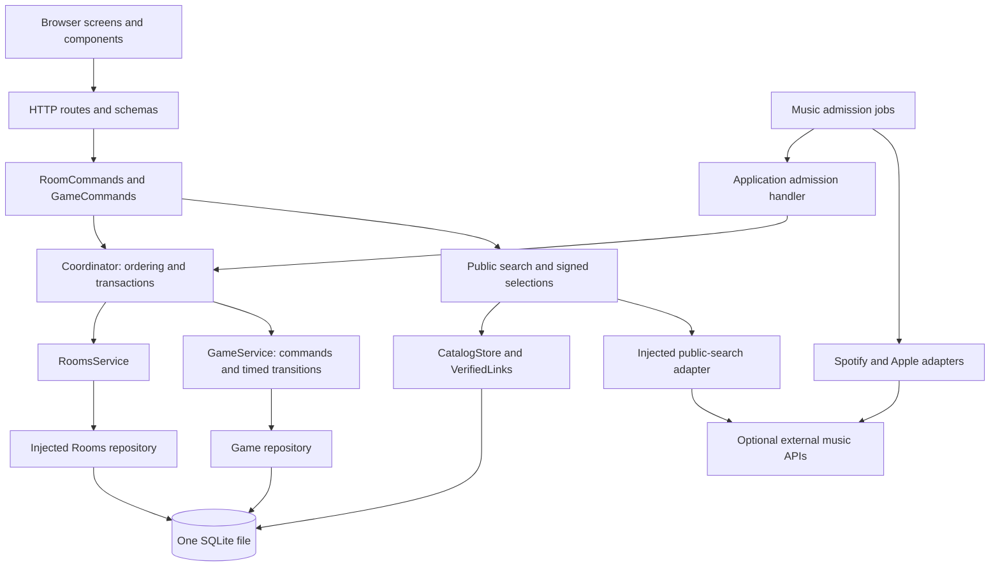

# 05 — Architecture

Current implementation, updated 2026-10-04. Assignment 1 requires a monolithic
application: one process, one SQLite path and one root dependency manifest.
The internal design is layered and organized around two business domains,
**Rooms** and **Game**. These are modules in one deployment, not microservices.
See [the data model](06_DATA_MODEL.md), [API contract](07_API_AND_RUNTIME.md)
and [codebase map](09_CODEBASE_MAP.md) for their concrete boundaries.

## Responsibilities and dependencies

| Layer/component | Owns | Does not own |
|---|---|---|
| HTTP presentation (`backend/api/`) | Strict request schemas, cookies, Origin checks, rate limits and response mapping | SQL, score formulas or multi-domain workflows |
| Application use cases (`RoomCommands`, `GameCommands`) | Named commands/queries, authorization context, token validation and domain orchestration | Provider transport or domain scoring |
| Application coordination (`Coordinator`) | Serialized room turns, acceptance time, transaction boundaries, due transitions and Rooms/Game lifecycle reconciliation | Song matching, score arithmetic or provider calls |
| Rooms domain | Admission, browser identity, roster, presence, private song memberships/familiarity and snapshot export | Selecting game rounds or scoring answers |
| Game domain | Frozen roster/song facts, full candidate plan, readiness, timed transitions, answer finality, scoring and rankings | Live Rooms SQL or music-provider credentials |
| Public catalog | Metadata indexing, query/preview caches, permanent verified links and signed selections | Personal listening evidence or hidden game-pool filtering |
| Music adapters | Spotify authorization/history, Apple catalog/previews and media validation | Room membership, game state or scoring |
| Browser application | Session drafts, transport, screen lifecycle and participant readiness | Server authority or recomputed scores |
| Host audio adapter | Audio unlock, active-tab lease, preload/decode, waveform extraction and playback scheduling | Guest readiness or admission |

`backend/app.py:create_app` is the backend composition root. It constructs the
configuration, coordinator, provider adapters, catalog store, importer,
admission jobs and named command objects, then injects them into HTTP routers.
`RoomsService` accepts its repository dependency. Scoring and selection receive
plain frozen values, with clock/random dependencies supplied where needed.
The current persistence API still passes SQLite connections into services for
shared local transactions; replacing persistence would require adapting that
transaction boundary, not merely swapping a network URL.

Repositories own table queries. HTTP handlers do not open database connections.
`GameService` owns both gameplay commands and clock-driven transitions; the
former separate `phases.py` controller has been removed. Its repository owns
score updates. The application calls `GameService.advance` and reconciles a
finished game's room state within the same transaction.

## Command ordering and room lifecycle

A protected command acquires the room's turn, captures server acceptance time,
authenticates the credential and checks due transitions. Due transitions commit
before an invalid incoming command can be rejected, preserving deadline closure.
The requested operation then runs in a short read or write context. Requests
with no due transition can use the read path; different rooms have independent
command locks, although SQLite still serializes writes.

`RoomLocks` counts both holders and queued waiters. They share one reentrant lock
for a room; the registry entry is removed only when its reference count reaches
zero. Failed requests for arbitrary room IDs therefore do not retain permanent
entries, and a queued command cannot acquire a replacement lock while an older
holder still runs. Cleanup uses this same ordering boundary.

Room admission and imports remain independent of an active match. Start freezes
roster, settings, song facts and listener familiarity, then marks the room as
playing in one transaction. Game uses these values throughout the match.
Changing or reseeding a catalog does not rewrite room song copies or frozen
results. New identities can join again only after the room returns to its lobby.

## Music admission and the public catalog

Normal mode imports each player's Spotify top/recent observations using that
player's authorization; Apple resolves usable previews and supplies independent
chart decoys. The importer preserves observed listener membership even when a
preview is unavailable. Admission needs at least ten playable personal songs;
listener facts describe the bounded imported observations, not lifetime history.
Provider work finishes outside room locks and database transactions. The atomic
admission handler then revalidates receipt, lobby, nickname, capacity and account
constraints before storing the normalized import.

Demo uses the pinned 100-song Drive pack: 80 personal recordings and 20 decoys.
Each participant receives 36 personal songs with simulated familiarity; decoys
have no listeners. First setup installs the verified pack before server startup;
the default ten-round and optional fifteen-round loops then work offline without
credentials. Canonical metadata and the source pin are committed, while installed
media stays under ignored `catalog/local/packs/`. There is no alternate synthetic
or festival catalog. [Catalog provenance](../catalog/README.md) explains setup,
validation and the private acquisition boundary.

Public search receives permitted Demo metadata values from the application layer.
Demo searches only these local catalog entries, including misses; it never
falls through to an external metadata provider. `LaunchMode` owns the process's
configured profile and gates Spotify admissions and authenticated room use;
Demo is available under either profile.
The browser receives enabled modes from `/api/config` before allowing admission.
`SongSearch` contains no queries against Rooms or listener tables; provider HTTP
transport is injected from `backend/music/`. Browser Search/Enter first uses
shared local metadata, persistent query results and verified provider mappings.
A bulk metadata result may require explicit provider verification before it can
become an answer. `CatalogSelections` receives only token, lookup, result and
verified-link dependencies, rather than inspecting a search object's internals.
Answer submission and scoring use signed facts without provider calls.

Positive links are scoped by provider/storefront and purpose (`guess` or
`recording`), saved in both directions and retained across games and restarts.
Identity fingerprints include the matching-rule version. A changed identity,
explicit rejection or matching-rule change requires fresh verification; elapsed
time alone does not expire a successful match. Temporary preview references and
query results have separate expiries. No public table stores player IDs,
listener maps or OAuth tokens.

## Browser readiness and host audio

`frontend/app.mjs` composes transport, application state/actions, runtime,
readiness, screen lifecycle and host audio. Screens render server projections
and emit intent. Reusable components retain stable DOM/SVG nodes across polling;
pure timing/result helpers do not calculate authoritative points.

`application/round-readiness.mjs` acknowledges the current round/attempt generation
for every participant. Guest readiness needs current state; host readiness also
requires a decoded clip, running audio context and valid audio lease. Readiness has its own cancellation
and generation guards. `audio/host.mjs` handles only host playback, with session
fences around asynchronous lease, manifest and decode operations. Resetting or
changing room invalidates pending work, so an old response cannot restore a
stale lease or publish a late error into a new session.

One host device currently plays audio for the room. Other devices guess and see
results. All-device audio is deferred: automatic readiness acknowledgements do
not establish audible playback or timing synchronization across speakers.

## Phase and failure ownership

The normal loop is `setup` (at least 5 s) → `ready` → `countdown` (3 s) →
`answering` (10/20/30 s, or all starting players submit) → `reveal` (5 s) →
`leaderboard` (5 s) → next `countdown` when prepared, otherwise `ready`. The final
leaderboard remains visible.

Audio for the full candidate plan is decoded during initial setup. As soon as a
round closes, Game stages the next playable candidate in a separate
`game_round_preparations` row without changing the current scored attempt. During
reveal and leaderboard, `application/upcoming-readiness.mjs` renews visible
participants' technical check-ins every two seconds. Guests receive only the
preparation identity; the host also receives the candidate ID needed to check its
decoded buffer. At promotion, acknowledgements must be no older than five seconds,
belong to connected players, and match the active audio lease for the host. Fresh
acknowledgements carry into the next attempt and allow its normal three-second
countdown immediately. Missing preparation retains the ten-second ready window
and existing retry/exclusion recovery. Preparation never starts audio or exposes
upcoming answers.

Game builds each original slot plus up to three distinct checked substitutes.
An unclosed playback failure voids its attempt and uses a checked reserve;
revealed attempts are final. Exhausted original slots are skipped. The game
aborts when cumulative skips exceed 30% of the original requested count, keeping
that denominator unchanged. Missing answers score zero; submitted Nobody is a
real answer. Initial missing readiness aborts preparation, while later missing
readiness allows host Retry or explicit barrier exclusions without deleting
players' score or answer eligibility.

Host presence is independent of its audio lease. An interrupted current round
can close; the next readiness window waits for the host. Host expiry or explicit
leave aborts with labelled partial results. Restart recovery aborts interrupted
games, preserves revealed scores and restores surviving rooms to lobby. These
rules remain in Game/Rooms, coordinated atomically by the application.

## Storage, runtime and verification

Both business domains and the public catalog use
`DATA_DIR/whos_on_repeat.sqlite3`. Rooms and Game own separate table groups;
public catalog tables have no private-membership foreign keys. The application
schema uses `PRAGMA user_version=6`; catalog schema version 3 is tracked in
`component_schema_versions`. All active catalog data lives in that file; no
legacy separate-catalog import path remains. See the data model for the exact
relationships and application migrations.

The process serves API, frontend and installed Demo media, binds `0.0.0.0` on `PORT`,
and applies migrations automatically. A lifespan task checks deadlines once per
second and periodically cleans expired rooms. Blocking storage/provider work is
offloaded from the async event loop. WAL, foreign keys and bounded busy timeouts
support local persistence. Run one worker: leases, OAuth receipts, query budgets,
settings and command locks are process-local. Assignment 1 adds no authored
Docker, CI workflow, managed database or extra deployed service.

Verification combines pure rule tests, isolated SQLite/HTTP integration tests,
frontend lifecycle tests and browser checks. Complete offline matches exercise
the installed pack media, signed searches, readiness, submissions, score persistence
and history. Audio assets are independently decoded, while physical speakers,
phone compatibility and Normal real-account behavior require device acceptance.
Historical PoC observations remain in [04_POC.md](04_POC.md); they are dated
experiments, not evidence that the current implementation has passed those gates.
