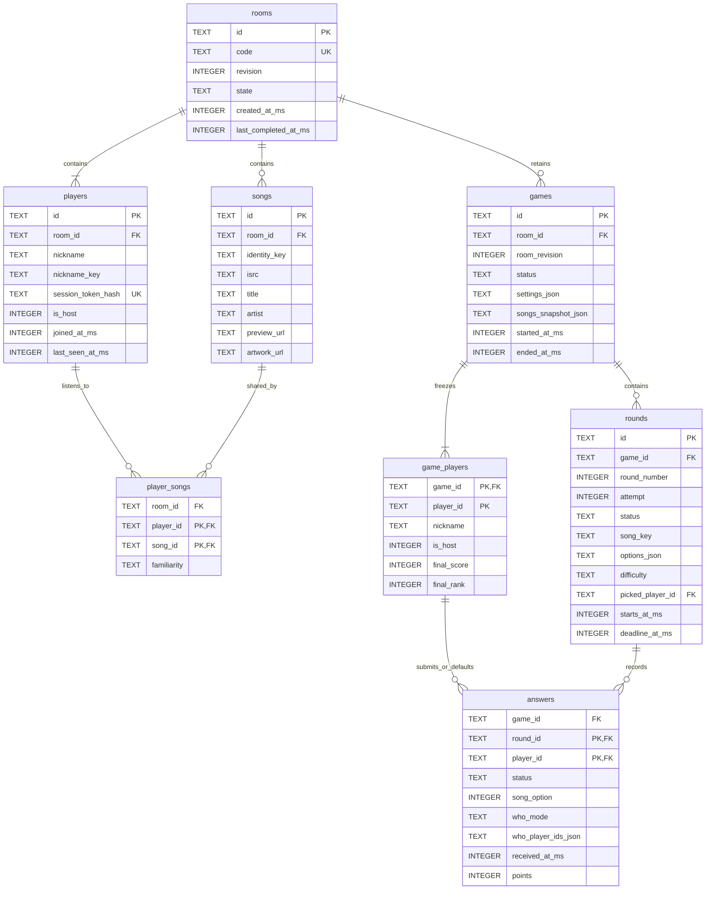

# 06 — Data Model

Date: 2026-09-30. Planned SQLite schema; the application is not implemented yet.
This follows [ADR-2 and ADR-3](../ADR.md) and the
[domain boundary](05_ARCHITECTURE.md#4-the-boundary-at-game-start).

## 1. Decisions made today

- Deduplicate songs within a room. Different rooms keep independent copies.
  Several players can reference the same song; familiarity belongs to that
  player–song relationship, not the shared song.
- Freeze songs and membership during a game. Only lobby automatic imports/updates are
  allowed. Players do not choose or inspect the normal game's song pool before
  play. Manual song picking is excluded; unavailable personal imports fall back to
  assigned demo data.
- Copy the starting roster and song facts into Game. A disconnected player
  remains in that game's roster and ranking; a missing answer is blank and
  scores zero. Reconnecting does not add a new participant.
- Reject new joins during a game, including a different browser attempting
  to join as a new identity. A valid existing identity can reconnect.
- Save final rankings, rounds, guesses and scores. The initial history screen
  shows final rankings only, not all the underlying song/listener data.
- Keep optional artwork references in songs and frozen game data, with a
  bundled placeholder when absent or unavailable. Retain failed-attempt answers,
  mark the attempt `void`, and exclude its points from live and final rankings.
- Retain the whole room until 30 days after its last completed game, or its
  creation if none completed. Visits, failed starts and aborted games do not
  extend the deadline. Each completed game renews the whole room lifetime,
  including its older history. Delete the room and associated data together.
- An explicit host leave ends the game immediately. A disconnected host has
  60 seconds after the last accepted heartbeat to reconnect before it ends.

## 2. Ownership and relationships

Rooms owns four tables. Game owns four tables. Both use the same SQLite file
at `DATA_DIR/whos_on_repeat.sqlite3` (`DATA_DIR` defaults to `./data`). The app
creates the schema automatically; no manual migration is needed for a fresh run.
All timestamps are server UTC milliseconds. IDs are random opaque strings.



The diagram shows the eight tables and their columns. Multi-column uniqueness,
checks and deletion rules are specified by the DDL below. The `game_players`
identity is copied from Rooms; it deliberately has no foreign key to `players`.
Deleting/changing live membership later must not change old rankings.

## 3. Shared songs and frozen game data

`songs.identity_key` is unique per room: prefer the normalized ISRC, otherwise
normalized title and artist as specified in the game rules. Preserve Unicode
letters when normalizing. The import service must reconcile an existing
title/artist record when an ISRC becomes available; a unique index alone does
not implement song matching. Two distinct ISRCs must not be merged just because
their titles match.

`player_songs` is the many-to-many link. Its composite foreign keys prevent
linking a player in one room to a song in another. The same song can be easy
for one player and hard for another. Repeated imports merge memberships rather
than creating duplicates, with the easiest source level winning.

Game uses relational rows for its roster, rounds and answers. Its immutable
song snapshot is a JSON array of song objects containing `song_key`, title,
artist, ISRC, preview source/URL, optional `artwork_url`, and listeners with their
per-player familiarity.
Decoy song facts are added during preparation with an empty listener list.
The snapshot does not contain provider user tokens or browser session tokens.
Game settings are another frozen JSON object.

`songs.artwork_url` is nullable: a provider image URL or a root-relative demo
asset URL, such as `/static/demo/covers/song-a.svg`, rather than a filesystem
path. Copy that reference into the game snapshot, including decoy songs.
Import adapters supply available artwork for Rooms to persist. Apple's
[song attributes](https://developer.apple.com/documentation/applemusicapi/songs/attributes-data.dictionary)
include `artwork`; the catalog adapter turns
[`attributes.artwork.url`](https://developer.apple.com/documentation/applemusicapi/artwork)
into a concrete URL by replacing `{w}` and `{h}` with `300` before storing or
passing it onward. If the imported song has no artwork, preparation can supply
it from the catalog match already used for preview resolution; Game freezes
that optional enrichment without changing Rooms records. Demo fixtures use
bundled cover URLs. Store only the reference, not image bytes in SQLite.
The reveal reads it from the frozen snapshot instead of fetching the current
Rooms record or calling a provider. Use the bundled placeholder
`/static/images/cover-placeholder.svg` when the reference is missing or the
image fails to load. A missing cover never invalidates an audio round. The
assets and reveal UI are planned, not files already present in this repository.

The service validates the snapshot against the roster before creating a game.
SQLite validates JSON shape; Game validates song keys, option uniqueness and
listener IDs inside the JSON. These are bounded immutable values passed through
the existing snapshot interface, not a substitute for relational membership.
History queries do not need to join against the current Rooms song pool.

## 4. Lifecycle, answers and retention

The game-start transaction checks the room revision, creates the game and
roster, and changes the room from `lobby` to `playing`. No network calls run
inside that transaction. A changed revision or failed insert rolls it back.
New joins, imports and edits are rejected while the room is playing.

Each round keeps four options in fixed slot order. An answer stores the slot,
not a client-supplied claim about which song was correct. `who_mode` distinguishes
`blank`, `nobody` and `players`; an empty selection is not silently scored as
"Nobody". Game validates selected player IDs against the frozen roster.

On round closure, insert a `missing` answer with zero points for every roster
member who did not submit. A disconnected player still waits for the deadline;
disconnection is not an early blank submission. A valid submitted answer is
preserved if the player disconnects afterwards. Late and duplicate submissions
are rejected. Scoring and round closure occur once in a transaction.

Failed clips produce a `void` attempt. Save its answers for diagnosis; do not
delete them. Any recorded points remain diagnostic and are excluded from
rankings. A replacement uses the same round number and a new attempt.
Only `revealed` attempts contribute to live totals and saved final rankings.
For example, 150 recorded points on a void attempt plus 200 points on its
revealed replacement contribute 200 points, while both answer rows remain.
The same song is never played
twice, including failed attempts. When a game ends, persist the roster's final
scores and shared ranks; use `completed` for a normally finished game and
`aborted` for a host leave, grace expiry or server interruption. Aborted games
can display partial rankings clearly labelled as interrupted.

Rooms owns heartbeat times and browser identity; the application asks Rooms
for host presence and tells Game to end when the 60-second grace expires.
Check expiry before accepting a returning host's heartbeat, so a late return
cannot revive an ended game. The exact heartbeat interval and cookie transport
will be specified in the API/security design. Only a digest of the random
browser credential is stored; recover the same player, never identify by nickname.

A completed game and `rooms.last_completed_at_ms` are saved in one transaction.
The retention deadline is `COALESCE(last_completed_at_ms, created_at_ms)` plus
2,592,000,000 milliseconds. Reject access to an expired room even before physical
cleanup, so an old code cannot revive it. An active game does not override this
deadline. A task inside the app periodically cleans up; it also runs at startup.
Cleanup calls Game to delete its games, then Rooms to delete the room, within
one transaction. This deletes membership, songs, snapshots, rounds and answers.
The cross-domain foreign key uses RESTRICT so a room cannot leave orphaned games.

## 5. Planned SQLite DDL

Enable foreign keys on every connection. The two domains write through their
own repositories. The local `games.room_id` foreign key does not permit Game
to query Rooms internals; a later service split will replace this database
constraint with an explicit cross-service lifecycle contract.

```sql
PRAGMA foreign_keys = ON;

CREATE TABLE rooms (
    id TEXT PRIMARY KEY NOT NULL,
    code TEXT NOT NULL UNIQUE,
    revision INTEGER NOT NULL DEFAULT 0 CHECK (revision >= 0),
    state TEXT NOT NULL DEFAULT 'lobby' CHECK (state IN ('lobby', 'playing')),
    created_at_ms INTEGER NOT NULL,
    last_completed_at_ms INTEGER CHECK (last_completed_at_ms >= created_at_ms)
);

CREATE TABLE players (
    id TEXT PRIMARY KEY NOT NULL,
    room_id TEXT NOT NULL REFERENCES rooms(id) ON DELETE CASCADE,
    nickname TEXT NOT NULL,
    nickname_key TEXT NOT NULL,
    session_token_hash TEXT NOT NULL UNIQUE,
    is_host INTEGER NOT NULL CHECK (is_host IN (0, 1)),
    joined_at_ms INTEGER NOT NULL,
    last_seen_at_ms INTEGER NOT NULL,
    UNIQUE (room_id, id),
    UNIQUE (room_id, nickname_key)
);
CREATE UNIQUE INDEX one_room_host ON players(room_id) WHERE is_host = 1;

CREATE TABLE songs (
    id TEXT PRIMARY KEY NOT NULL,
    room_id TEXT NOT NULL REFERENCES rooms(id) ON DELETE CASCADE,
    identity_key TEXT NOT NULL,
    isrc TEXT,
    title TEXT NOT NULL,
    artist TEXT NOT NULL,
    preview_url TEXT,
    artwork_url TEXT,
    UNIQUE (room_id, id),
    UNIQUE (room_id, identity_key)
);

CREATE TABLE player_songs (
    room_id TEXT NOT NULL,
    player_id TEXT NOT NULL,
    song_id TEXT NOT NULL,
    familiarity TEXT NOT NULL CHECK (familiarity IN ('easy', 'medium', 'hard')),
    PRIMARY KEY (player_id, song_id),
    FOREIGN KEY (room_id, player_id) REFERENCES players(room_id, id) ON DELETE CASCADE,
    FOREIGN KEY (room_id, song_id) REFERENCES songs(room_id, id) ON DELETE CASCADE
);

CREATE TABLE games (
    id TEXT PRIMARY KEY NOT NULL,
    room_id TEXT NOT NULL REFERENCES rooms(id) ON DELETE RESTRICT,
    room_revision INTEGER NOT NULL CHECK (room_revision >= 0),
    status TEXT NOT NULL CHECK (status IN ('playing', 'completed', 'aborted')),
    settings_json TEXT NOT NULL CHECK (json_valid(settings_json) AND json_type(settings_json) = 'object'),
    songs_snapshot_json TEXT NOT NULL CHECK (json_valid(songs_snapshot_json) AND json_type(songs_snapshot_json) = 'array'),
    started_at_ms INTEGER NOT NULL,
    ended_at_ms INTEGER CHECK (ended_at_ms >= started_at_ms),
    CHECK ((status = 'playing' AND ended_at_ms IS NULL) OR (status != 'playing' AND ended_at_ms IS NOT NULL))
);
CREATE INDEX games_by_room ON games(room_id);
CREATE UNIQUE INDEX one_active_game ON games(room_id) WHERE status = 'playing';

CREATE TABLE game_players (
    game_id TEXT NOT NULL REFERENCES games(id) ON DELETE CASCADE,
    player_id TEXT NOT NULL,
    nickname TEXT NOT NULL,
    is_host INTEGER NOT NULL CHECK (is_host IN (0, 1)),
    final_score INTEGER CHECK (final_score >= 0),
    final_rank INTEGER CHECK (final_rank >= 1),
    PRIMARY KEY (game_id, player_id),
    CHECK ((final_score IS NULL) = (final_rank IS NULL))
);
CREATE UNIQUE INDEX one_game_host ON game_players(game_id) WHERE is_host = 1;

CREATE TABLE rounds (
    id TEXT PRIMARY KEY NOT NULL,
    game_id TEXT NOT NULL REFERENCES games(id) ON DELETE CASCADE,
    round_number INTEGER NOT NULL CHECK (round_number BETWEEN 1 AND 15),
    attempt INTEGER NOT NULL DEFAULT 1 CHECK (attempt >= 1),
    status TEXT NOT NULL CHECK (status IN ('ready', 'playing', 'revealed', 'void')),
    song_key TEXT NOT NULL,
    options_json TEXT NOT NULL CHECK (json_valid(options_json) AND json_type(options_json) = 'array' AND json_array_length(options_json) = 4),
    difficulty TEXT NOT NULL CHECK (difficulty IN ('easy', 'medium', 'hard', 'decoy')),
    picked_player_id TEXT,
    starts_at_ms INTEGER,
    deadline_at_ms INTEGER,
    UNIQUE (game_id, id),
    UNIQUE (game_id, round_number, attempt),
    UNIQUE (game_id, song_key),
    FOREIGN KEY (game_id, picked_player_id) REFERENCES game_players(game_id, player_id),
    CHECK ((difficulty = 'decoy' AND picked_player_id IS NULL) OR (difficulty != 'decoy' AND picked_player_id IS NOT NULL)),
    CHECK ((starts_at_ms IS NULL AND deadline_at_ms IS NULL) OR (starts_at_ms IS NOT NULL AND deadline_at_ms IS NOT NULL AND deadline_at_ms > starts_at_ms)),
    CHECK (status != 'playing' OR starts_at_ms IS NOT NULL)
);
CREATE UNIQUE INDEX one_playing_round ON rounds(game_id) WHERE status = 'playing';

CREATE TABLE answers (
    game_id TEXT NOT NULL,
    round_id TEXT NOT NULL,
    player_id TEXT NOT NULL,
    status TEXT NOT NULL CHECK (status IN ('submitted', 'missing')),
    song_option INTEGER CHECK (song_option BETWEEN 0 AND 3),
    who_mode TEXT NOT NULL CHECK (who_mode IN ('blank', 'nobody', 'players')),
    who_player_ids_json TEXT NOT NULL DEFAULT '[]' CHECK (json_valid(who_player_ids_json) AND json_type(who_player_ids_json) = 'array'),
    received_at_ms INTEGER,
    points INTEGER CHECK (points >= 0),
    PRIMARY KEY (round_id, player_id),
    FOREIGN KEY (game_id, round_id) REFERENCES rounds(game_id, id) ON DELETE CASCADE,
    FOREIGN KEY (game_id, player_id) REFERENCES game_players(game_id, player_id) ON DELETE CASCADE,
    CHECK ((who_mode = 'players' AND json_array_length(who_player_ids_json) > 0) OR (who_mode != 'players' AND json_array_length(who_player_ids_json) = 0)),
    CHECK ((status = 'submitted' AND received_at_ms IS NOT NULL) OR (status = 'missing' AND received_at_ms IS NULL AND song_option IS NULL AND who_mode = 'blank' AND points IS NOT NULL AND points = 0))
);
```

The planned ranking query includes the whole frozen roster and sums points
only from revealed attempts. A retained answer on a void attempt cannot add
points, even if it had already been scored before the clip failure was recorded:

```sql
SELECT p.player_id, p.nickname,
       COALESCE(SUM(CASE WHEN r.status = 'revealed' THEN a.points ELSE 0 END), 0) AS total_points
FROM game_players AS p
LEFT JOIN answers AS a ON a.game_id = p.game_id AND a.player_id = p.player_id
LEFT JOIN rounds AS r ON r.game_id = a.game_id AND r.id = a.round_id
WHERE p.game_id = :game_id
GROUP BY p.game_id, p.player_id, p.nickname;
```

Round-failure handling marks the attempt void and invalidates any derived
ranking in the same transaction. Final scores/ranks are saved from this filtered
total; diagnostic answer rows are never summed without their attempt status.
The API design must settle when a clip-failure report can be accepted relative
to reveal/finalization so a late report cannot leave a stale saved ranking.

## 6. What the database cannot decide

Services must enforce the 3–10 player start limit, at least ten songs per player,
exactly one host at creation, room/game state transitions, snapshot revision,
JSON contents and candidate/listener identity, time limits, host authorization,
half-up scoring and retention. Database constraints back those checks; they
do not replace the service behavior or its tests.

Before real-provider implementation: choose the first import provider and its
familiarity mapping. Next, define API/session behavior and implement the demo
core. The schema serves assigned demo data without live provider credentials
and has no manual-pick or manual-tagging path.


## 7. Schema review on 2026-09-30

The SQL above was executed against a temporary SQLite 3.46.0 database, with
foreign keys enabled. Checks passed for room/nickname/host uniqueness, room-local
song deduplication, different per-player familiarity, cross-room membership
rejection, JSON shapes, one active game/round, option counts, timestamp pairs,
same-game answer references, duplicate answers and explicit blank/zero missing
answers. Later live song/player changes left the frozen game records intact.

Game-first room deletion cascaded through the expected data, kept another room
intact and left no foreign-key violations. The remaining data survived closing
and reopening the database file. An independent schema review also checked
composite foreign keys and cascade order.

These are checks of the proposed schema. They are not application service tests,
proof of heartbeat/scoring behavior or the assignment's 70% coverage result.
The chosen Python/SQLite runtime must support the JSON functions used here.

Follow-up verification checked nullable/local artwork references and frozen
artwork surviving changes to the live song. The documented ranking query
excluded a void attempt's 150 recorded points, counted its revealed replacement's
200 points, and kept unanswered roster members at zero. Both attempts and their
answers remained stored. Placeholder rendering still needs browser verification
once the reveal UI and bundled assets exist.
