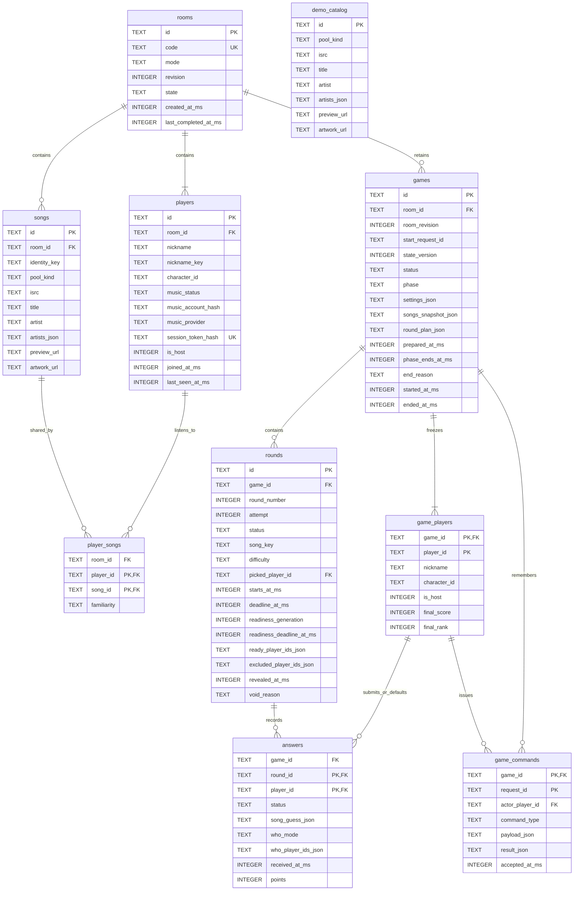

# 06 — Data Model

Initial schema date: 2026-09-30. Current SQLite schema version: **4**.
Migration 1 creates the original ten tables; migration 2 replaces option-slot
answers with frozen selected-song facts while preserving existing history.
Migration 3 translates previous character IDs into color IDs for the shared blob.
Migration 4 adds room-scoped verified music-account digests and explicit song pool kinds.
See [implementation status](08_IMPLEMENTATION_STATUS.md) for current evidence.
This follows [the ADRs](../ADR.md), the
[domain boundary](05_ARCHITECTURE.md#4-the-boundary-at-start) and
[API/runtime contract](07_API_AND_RUNTIME.md).

## 1. Decisions made today

- Deduplicate songs within a room. Different rooms keep independent copies.
  Several players can reference the same song; familiarity belongs to that
  player–song relationship, not the shared song.
- Freeze songs and membership during a game. Only lobby automatic imports/updates are
  allowed. Players do not choose or inspect the normal game's song pool before
  play. Manual song picking is excluded. The host explicitly chooses Normal or
  Demo before joins; failed Normal imports never silently substitute demo data.
- Copy the starting roster, nickname/character and song/credited-artist facts into Game. A disconnected player
  remains in that game's roster and ranking; a missing answer is blank and
  scores zero. Reconnecting does not add a new participant.
- Reject new joins during a game, including a different browser attempting
  to join as a new identity. A valid existing identity can reconnect.
- Save final rankings, rounds, guesses and scores. The initial history screen
  shows final rankings only, not all the underlying song/listener data.
- Keep answer storage separate from public projections. A reveal exposes only
  the authenticated caller's answer and feedback; another player's answers
  never reach game state, results or history, including for the host. Correct
  song/listener facts, submission status and ranking totals remain shared.
- Keep optional artwork references in songs and frozen game data, with a
  bundled placeholder when absent or unavailable. Retain failed-attempt answers,
  mark the attempt `void`, and exclude its points from live and final rankings.
- Retain the whole room until 30 days after its last completed game, or its
  creation if none completed. Visits, failed starts and aborted games do not
  extend the deadline. Each completed game renews the whole room lifetime,
  including its older history. Delete the room and associated data together.
- An explicit host leave ends the game immediately. A disconnected host has
  60 seconds after the last accepted heartbeat to reconnect before it ends.

## 2. Ownership and relationships

Rooms owns five tables, including the seeded `demo_catalog`. Game owns five,
including durable command receipts. Both use the same SQLite file
at `DATA_DIR/whos_on_repeat.sqlite3` (`DATA_DIR` defaults to `./data`). The app
creates/seeds the schema automatically; versioned migrations handle later
upgrades. Demo fixtures are application-owned templates, not another room
whose retention can expire. Their song facts are copied into room-local songs
when assigned; deleting a room does not delete the shared fixture catalog.
All timestamps are server UTC milliseconds. IDs are random opaque strings.



The diagram shows the current ten tables and their columns. Multi-column uniqueness,
checks and deletion rules are specified by the migrations below. The `game_players`
identity is copied from Rooms; it deliberately has no foreign key to `players`.
Deleting/changing live membership later must not change old rankings.

## 3. Shared songs and frozen game data

`songs.identity_key` is unique per room: prefer the normalized ISRC, otherwise
the provider-qualified Spotify track identity for Normal imports, or normalized
title/artist where the existing fixture rules apply. Preserve Unicode letters
when normalizing. The import service must reconcile an existing
title/artist record when an ISRC becomes available; a unique index alone does
not implement song matching. Two distinct ISRCs must not be merged just because
their titles match. Conversely, a reused/mislabeled ISRC with incompatible
normalized title/version or credited artist receives a separate variant key
rather than merging its media and listener ownership.

`player_songs` is the many-to-many link. Its composite foreign keys prevent
linking a player in one room to a song in another. The same song can be easy
for one player and hard for another. Repeated imports merge memberships rather
than creating duplicates, with the easiest source level winning.

Game uses relational rows for its roster, rounds and answers. Its immutable
song snapshot is a JSON array of song objects containing `song_key`, title,
display artist plus structured credited-artist keys/names, ISRC, preview source/URL,
optional `artwork_url`, and listeners with their
per-player familiarity.
Normal imports persist `pool_kind = personal|decoy` alongside room-local songs.
Observed personal songs retain their player memberships even when their preview
is unavailable; only rows with playable references enter the game snapshot.
If another import supplies media for that same identity, all previously observed
memberships are recovered. An independent chart candidate becomes personal when
an imported player dataset contains it. A decoy means absent from the imported
datasets, not proof that nobody has ever heard it. Demo decoy facts are added
from shared fixtures with an empty listener list.
The snapshot does not contain provider user tokens, account digests or browser session tokens.
Game settings are another frozen JSON object, including mode and original
requested round count. The roster/characters freeze at Start; final song facts
and `round_plan_json` freeze when setup completes (`prepared_at_ms`), before
initial readiness/scored play. Neither receives live edits afterward.

`songs.artists_json` and demo fixtures contain bounded structured credits such
as `[{"artist_key":"demo:artist-a","name":"Artist A"}]`. Use provider-qualified
canonical IDs for real credits, reconciling candidates from different adapters.
Do not infer guest identities by substring/splitting a display string. Validate
credit completeness with the chosen real provider before enabling its artist
partial-credit path; fixtures provide known identities from the start. The
Apple developer adapter requests structured artist relationships. On a verified
recording match, a Spotify credit can retain its canonical `artist_key` and add
an `aliases` array of Apple artist IDs only when the credited names match.
ISRC matches must also pass title/version and lead-artist validation before
preview enrichment. Pure scoring uses frozen keys/aliases, never substring
matching. Public iTunes fallback has only its primary artist ID; extra featured
credits are not inferred from display strings.

`round_plan_json` contains one object per original requested slot: slot number,
source player/difficulty, original candidate, ordered checked candidates and
setup candidate-check outcomes, optional per-candidate waveform levels,
substitutions already used,
chosen playable song or skipped status, and remaining checked reserves. Keep
candidate song facts in the frozen song snapshot. Preserve requested slot
numbers and the original denominator for strict 30% cancellation. Runtime
attempt rows refer to these prepared candidates; runtime failure/retry progress
does not rewrite the immutable plan. Count setup and runtime skips once per
original slot. Enough distinct songs/reserves are a service check.

`demo_catalog` is seeded automatically from `catalog/demo_catalog.json`, with
`personal` and `decoy` entries, explicit artist keys and root-relative media.
The Rooms demo adapter makes hidden random assignments into `songs` and
`player_songs`, with per-player familiarity. The shared catalog contains no
personal provider tokens and is independent of room cleanup.

`songs.artwork_url` is nullable: a provider image URL or a root-relative demo
asset URL, such as `/static/demo/covers/song-a.svg`, rather than a filesystem
path. Copy that reference into the game snapshot, including decoy songs.
Import adapters supply available artwork for Rooms to persist. Apple's
[song attributes](https://developer.apple.com/documentation/applemusicapi/songs/attributes-data.dictionary)
include `artwork`; the catalog adapter turns
[`attributes.artwork.url`](https://developer.apple.com/documentation/applemusicapi/artwork)
into a concrete URL by replacing `{w}` and `{h}` with `300` before storing or
passing it onward. If the imported song has no artwork, preparation can supply
it from the catalog match already used for preview resolution; Game freezes
that optional enrichment without changing Rooms records. Demo fixtures use
bundled cover URLs. Store only the reference, not image bytes in SQLite.
The reveal reads it from the frozen snapshot instead of fetching the current
Rooms record or calling a provider. The frontend displays a music-icon
placeholder when the reference is missing or the image fails to load. Its
placeholder asset path is a presentation choice, not a persisted song value. A
missing cover never invalidates an audio round. This backend checkpoint serves
its bundled demo cover from `catalog/assets/covers/` at `/static/demo/covers/`;
the reveal uses frozen references and its fallback; Normal imports now enrich
recordings through Apple catalog metadata before admission.

The service validates the snapshot against the roster before creating a game.
SQLite validates JSON shape; Game validates candidate song-key uniqueness and
listener IDs inside the JSON. These are bounded immutable values passed through
the existing snapshot interface, not a substitute for relational membership.
History queries do not need to join against the current Rooms song pool.

## 4. Lifecycle, answers and retention

The Start transaction verifies host/mode/import readiness and room revision,
creates a `preparing` game/starting roster and sets the room to `playing`
(including setup). No provider calls run inside it. New joins, character edits,
imports and membership changes are rejected until the lobby returns. Setup
completes/finalizes the full checked sequence before the first readiness cycle.
A setup cancellation or initial ten-second readiness timeout aborts preparation
and restores the lobby without renewing retention or awarding points.

Games separate terminal `status` from presentation `phase`: status is preparing,
playing, completed or aborted; phase is setup, ready, countdown, answering,
reveal, leaderboard or finished. `phase_ends_at_ms` owns the five-second setup
minimum, three-second countdown, five-second reveal and five-second leaderboard.
`started_at_ms` is host Start acceptance, not the audio/scoring start. A game
becomes playing when its first countdown is scheduled. Completed/aborted games
have a finished phase, end time/cause and saved full-roster rankings.

Create an actual round attempt only when activating a prepared slot. `ready`
includes waiting for check-ins and a scheduled countdown; `playing` begins at
`starts_at_ms`. One ready/playing attempt per game prevents duplicate activation.
Round rows hold the selected candidate key, difficulty/source player, server audio start
and deadline, readiness generation/deadline, ACK IDs, barrier exclusions and
reveal/void cause. Retry increments generation and clears ACKs/exclusions for the
same unstarted attempt. Continue can exclude only currently unready non-host IDs
from the current barrier; it never changes the roster or creates an answer.
Initial timeout aborts setup; later timeouts wait for the host's recovery choice.
The host cannot be excluded. Exclusions expire at the next generation/round.

An answer stores `song_guess_json`: JSON null or a frozen metadata object with
`song_key`, `title`, `artist`, structured `artists` and optional `artwork_url`.
The object comes from a server-signed room-scoped catalog selection, not client
claims of correctness or freely supplied metadata. The token itself is transient
and is not stored in SQLite; selection facts remain useful for retries and
failed-attempt diagnosis.
A submitted empty listener list becomes `who_mode = 'nobody'`; a nonempty list
becomes `players`. `blank` is reserved for a missing submission. A null song
selection can coexist with a submitted who guess. No Submit by deadline inserts a
`missing` answer with zero total points for that roster member. A disconnected
or barrier-excluded player can reconnect and submit before the deadline; absence
alone is not an early blank answer. Validate all selected IDs against the frozen
roster. Identical accepted-answer retries return the stored receipt even after
closure; changed second answers conflict. Enforce `[start, deadline)` and atomic
closure/scoring as specified in `07_API_AND_RUNTIME.md`.

Answer rows remain internal persisted records. At reveal, project only the
authenticated player's row into `reveal.my_answer`, alongside the shared correct
song and actual listener IDs. A missing answer projects `status = 'missing'`,
`song_guess = null`, `who_player_ids = null` and zero points. A submitted Nobody
answer projects `status = 'submitted'` and `who_player_ids = []`; these cases
must not be conflated. The host receives the same privacy projection as every
other player. No public list of all answer rows exists.

Full credit matches a nonempty stable frozen song/track key, or a compatible
normalized title with a common frozen structured artist key/alias. ISRC alone
never awards full credit. The shared normalizer applies Unicode decomposition,
case folding, diacritic removal and word-based punctuation/whitespace handling,
and removes trailing parenthesized/bracketed featured-artist credit only.
Live/remix/instrumental/remaster version labels remain distinct; no fuzzy
matching is performed.
Artist-only credit uses frozen structured identities: a wrong selected song sharing any
credited artist earns 50 once, no speed/perfect bonus. Correct song and ordinary
listener/difficulty/exact arithmetic rules remain in `03_GAME_RULES.md`.

A current audio failure accepted before closure produces `void`; retain answers
and any diagnostic points but never count them in rankings. Revealed attempts
are final. A replacement uses the same original slot number with a new attempt,
within its total original-plus-three candidate budget; `attempt` is therefore
bounded by 4, while readiness Retry does not increment it. If all checked
reserves are exhausted, skip that original slot and enforce the cumulative strict
30% cancellation rule. Preserve partial results on a runtime abort. Only
`revealed` attempts count toward live/saved rankings: diagnostic 150 on void plus
200 on its revealed replacement contributes 200, retaining both answer rows.

`games.start_request_id` is unique per room. It finds an earlier Start even after
completion/restart, preventing a repeated request from starting another match.
`game_commands` records accepted host-command IDs, actor, normalized payload and
minimal result in the same transaction as their effect. Identical retries return
that effect; changed ID reuse conflicts. Selected attempt/generation is explicit,
never whichever round happens to be current. This receipt table contains no
provider/browser secrets or audio manifest. `state_version` increases for visible
state changes so clients ignore older polls; ACK validity uses attempt/generation,
not a state version changed by someone else's ACK.

Rooms owns five-second heartbeats and room-scoped browser identity. An in-process
presence check enforces the host's 60-second grace; requests enforce expiry before
accepting a returning heartbeat. Polling and ACKs do not renew presence. Capture
only a credential digest in SQLite; no nickname/device recovery. During host
absence the current timed phases can finish, then wait on the leaderboard before
opening the next readiness window. Explicit leave aborts immediately. One host
browser tab controls audio; lease state is transient and discarded on restart.

Startup recovery voids ready/playing attempts in interrupted preparing/playing
games, preserves revealed scores, aborts with a server-restart cause, saves partial
ranks and restores surviving rooms to lobby in one transaction. This does not
pretend completion or renew retention. Use migration/version metadata so automatic
setup handles schema evolution without discarding existing rooms/results.

A completed game and `rooms.last_completed_at_ms` are saved in one transaction.
The retention deadline is `COALESCE(last_completed_at_ms, created_at_ms)` plus
2,592,000,000 milliseconds. Reject access to an expired room even before physical
cleanup, so an old code cannot revive it. An active game does not override this
deadline. A task inside the app periodically cleans up; it also runs at startup.
Cleanup calls Game to delete its games, then Rooms to delete the room, within
one transaction. This deletes membership, songs, snapshots, rounds and answers.
The cross-domain foreign key uses RESTRICT so a room cannot leave orphaned games.

## 5. Versioned SQLite DDL

Enable foreign keys on every connection. The two domains write through their
own repositories. The local `games.room_id` foreign key does not permit Game
to query Rooms internals; a later service split will replace this database
constraint with an explicit cross-service lifecycle contract.

### Migration 4: verified accounts and pool kinds

[`004_music_admission.sql`](../backend/storage/migrations/004_music_admission.sql)
adds nullable `players.music_account_hash`, with a unique index on
`(room_id, music_provider, music_account_hash)` for non-null values. It is a
room-scoped digest, not the Spotify account ID or an OAuth token. Normal admitted
players have `music_provider = spotify` and `music_status = ready`; Demo keeps its
existing nullable provider/account fields. An account cannot enter the same room
as several players, including after loss of its browser credential.

The migration also adds `songs.pool_kind`, constrained to `personal|decoy`, with
`personal` as the default for existing rows. No existing answers or snapshots are
rewritten. OAuth state/verifiers and access tokens stay in expiring process
memory; they are not a new SQLite table.

### Historical migration 1

The following is the original [001_initial.sql](../backend/storage/migrations/001_initial.sql).
Its `options_json` and `song_option` columns are migration inputs, not the current
API or schema. Fresh databases apply all four migrations before becoming ready;
existing version-1 databases upgrade without discarding rooms or results.

```sql
PRAGMA foreign_keys = ON;

CREATE TABLE rooms (
    id TEXT PRIMARY KEY NOT NULL,
    code TEXT NOT NULL UNIQUE CHECK (length(code) = 6),
    mode TEXT NOT NULL CHECK (mode IN ('normal', 'demo')),
    revision INTEGER NOT NULL DEFAULT 0 CHECK (revision >= 0),
    state TEXT NOT NULL DEFAULT 'lobby' CHECK (state IN ('lobby', 'playing')),
    created_at_ms INTEGER NOT NULL,
    last_completed_at_ms INTEGER CHECK (last_completed_at_ms >= created_at_ms)
);

CREATE TABLE players (
    id TEXT PRIMARY KEY NOT NULL,
    room_id TEXT NOT NULL REFERENCES rooms(id) ON DELETE CASCADE,
    nickname TEXT NOT NULL,
    nickname_key TEXT NOT NULL,
    character_id TEXT NOT NULL,
    music_status TEXT NOT NULL CHECK (music_status IN ('authorized', 'ready', 'failed', 'demo')),
    music_provider TEXT,
    session_token_hash TEXT NOT NULL UNIQUE,
    is_host INTEGER NOT NULL CHECK (is_host IN (0, 1)),
    joined_at_ms INTEGER NOT NULL,
    last_seen_at_ms INTEGER NOT NULL,
    CHECK ((music_status = 'demo' AND music_provider IS NULL) OR (music_status != 'demo' AND music_provider IS NOT NULL)),
    UNIQUE (room_id, id),
    UNIQUE (room_id, nickname_key)
);
CREATE UNIQUE INDEX one_room_host ON players(room_id) WHERE is_host = 1;

CREATE TABLE songs (
    id TEXT PRIMARY KEY NOT NULL,
    room_id TEXT NOT NULL REFERENCES rooms(id) ON DELETE CASCADE,
    identity_key TEXT NOT NULL,
    isrc TEXT,
    title TEXT NOT NULL,
    artist TEXT NOT NULL,
    artists_json TEXT NOT NULL CHECK (json_valid(artists_json) AND json_type(artists_json) = 'array' AND json_array_length(artists_json) >= 1),
    preview_url TEXT,
    artwork_url TEXT,
    UNIQUE (room_id, id),
    UNIQUE (room_id, identity_key)
);

CREATE TABLE demo_catalog (
    id TEXT PRIMARY KEY NOT NULL,
    pool_kind TEXT NOT NULL CHECK (pool_kind IN ('personal', 'decoy')),
    isrc TEXT,
    title TEXT NOT NULL,
    artist TEXT NOT NULL,
    artists_json TEXT NOT NULL CHECK (json_valid(artists_json) AND json_type(artists_json) = 'array' AND json_array_length(artists_json) >= 1),
    preview_url TEXT NOT NULL,
    artwork_url TEXT
);

CREATE TABLE player_songs (
    room_id TEXT NOT NULL,
    player_id TEXT NOT NULL,
    song_id TEXT NOT NULL,
    familiarity TEXT NOT NULL CHECK (familiarity IN ('easy', 'medium', 'hard')),
    PRIMARY KEY (player_id, song_id),
    FOREIGN KEY (room_id, player_id) REFERENCES players(room_id, id) ON DELETE CASCADE,
    FOREIGN KEY (room_id, song_id) REFERENCES songs(room_id, id) ON DELETE CASCADE
);

CREATE TABLE games (
    id TEXT PRIMARY KEY NOT NULL,
    room_id TEXT NOT NULL REFERENCES rooms(id) ON DELETE RESTRICT,
    room_revision INTEGER NOT NULL CHECK (room_revision >= 0),
    start_request_id TEXT NOT NULL,
    state_version INTEGER NOT NULL DEFAULT 0 CHECK (state_version >= 0),
    status TEXT NOT NULL CHECK (status IN ('preparing', 'playing', 'completed', 'aborted')),
    phase TEXT NOT NULL CHECK (phase IN ('setup', 'ready', 'countdown', 'answering', 'reveal', 'leaderboard', 'finished')),
    settings_json TEXT NOT NULL CHECK (json_valid(settings_json) AND json_type(settings_json) = 'object'),
    songs_snapshot_json TEXT NOT NULL CHECK (json_valid(songs_snapshot_json) AND json_type(songs_snapshot_json) = 'array'),
    round_plan_json TEXT NOT NULL DEFAULT '[]' CHECK (json_valid(round_plan_json) AND json_type(round_plan_json) = 'array'),
    started_at_ms INTEGER NOT NULL,
    prepared_at_ms INTEGER CHECK (prepared_at_ms >= started_at_ms),
    phase_ends_at_ms INTEGER,
    end_reason TEXT,
    ended_at_ms INTEGER CHECK (ended_at_ms >= started_at_ms),
    UNIQUE (room_id, start_request_id),
    CHECK ((status IN ('preparing', 'playing') AND ended_at_ms IS NULL AND end_reason IS NULL AND phase != 'finished')
        OR (status IN ('completed', 'aborted') AND ended_at_ms IS NOT NULL AND end_reason IS NOT NULL AND phase = 'finished' AND phase_ends_at_ms IS NULL)),
    CHECK (status != 'preparing' OR phase IN ('setup', 'ready')),
    CHECK (status != 'playing' OR phase IN ('ready', 'countdown', 'answering', 'reveal', 'leaderboard')),
    CHECK (status NOT IN ('playing', 'completed') OR prepared_at_ms IS NOT NULL),
    CHECK (phase NOT IN ('setup', 'countdown', 'reveal', 'leaderboard') OR phase_ends_at_ms IS NOT NULL),
    CHECK (phase_ends_at_ms IS NULL OR phase_ends_at_ms >= started_at_ms)
);
CREATE INDEX games_by_room ON games(room_id);
CREATE UNIQUE INDEX one_active_game ON games(room_id) WHERE status IN ('preparing', 'playing');

CREATE TABLE game_players (
    game_id TEXT NOT NULL REFERENCES games(id) ON DELETE CASCADE,
    player_id TEXT NOT NULL,
    nickname TEXT NOT NULL,
    character_id TEXT NOT NULL,
    is_host INTEGER NOT NULL CHECK (is_host IN (0, 1)),
    final_score INTEGER CHECK (final_score >= 0),
    final_rank INTEGER CHECK (final_rank >= 1),
    PRIMARY KEY (game_id, player_id),
    CHECK ((final_score IS NULL) = (final_rank IS NULL))
);
CREATE UNIQUE INDEX one_game_host ON game_players(game_id) WHERE is_host = 1;

CREATE TABLE rounds (
    id TEXT PRIMARY KEY NOT NULL,
    game_id TEXT NOT NULL REFERENCES games(id) ON DELETE CASCADE,
    round_number INTEGER NOT NULL CHECK (round_number BETWEEN 1 AND 15),
    attempt INTEGER NOT NULL DEFAULT 1 CHECK (attempt BETWEEN 1 AND 4),
    status TEXT NOT NULL CHECK (status IN ('ready', 'playing', 'revealed', 'void')),
    song_key TEXT NOT NULL,
    options_json TEXT NOT NULL CHECK (json_valid(options_json) AND json_type(options_json) = 'array' AND json_array_length(options_json) = 4),
    difficulty TEXT NOT NULL CHECK (difficulty IN ('easy', 'medium', 'hard', 'decoy')),
    picked_player_id TEXT,
    starts_at_ms INTEGER,
    deadline_at_ms INTEGER,
    readiness_generation INTEGER NOT NULL DEFAULT 1 CHECK (readiness_generation >= 1),
    readiness_deadline_at_ms INTEGER NOT NULL,
    ready_player_ids_json TEXT NOT NULL DEFAULT '[]' CHECK (json_valid(ready_player_ids_json) AND json_type(ready_player_ids_json) = 'array'),
    excluded_player_ids_json TEXT NOT NULL DEFAULT '[]' CHECK (json_valid(excluded_player_ids_json) AND json_type(excluded_player_ids_json) = 'array'),
    revealed_at_ms INTEGER,
    void_reason TEXT,
    UNIQUE (game_id, id),
    UNIQUE (game_id, round_number, attempt),
    UNIQUE (game_id, song_key),
    FOREIGN KEY (game_id, picked_player_id) REFERENCES game_players(game_id, player_id),
    CHECK ((difficulty = 'decoy' AND picked_player_id IS NULL) OR (difficulty != 'decoy' AND picked_player_id IS NOT NULL)),
    CHECK ((starts_at_ms IS NULL AND deadline_at_ms IS NULL) OR (starts_at_ms IS NOT NULL AND deadline_at_ms IS NOT NULL AND deadline_at_ms > starts_at_ms)),
    CHECK (status NOT IN ('playing', 'revealed') OR starts_at_ms IS NOT NULL),
    CHECK ((status = 'revealed' AND revealed_at_ms IS NOT NULL AND revealed_at_ms >= starts_at_ms) OR (status != 'revealed' AND revealed_at_ms IS NULL)),
    CHECK ((status = 'void' AND void_reason IS NOT NULL) OR (status != 'void' AND void_reason IS NULL))
);
CREATE UNIQUE INDEX one_active_round ON rounds(game_id) WHERE status IN ('ready', 'playing');

CREATE TABLE answers (
    game_id TEXT NOT NULL,
    round_id TEXT NOT NULL,
    player_id TEXT NOT NULL,
    status TEXT NOT NULL CHECK (status IN ('submitted', 'missing')),
    song_option INTEGER CHECK (song_option BETWEEN 0 AND 3),
    who_mode TEXT NOT NULL CHECK (who_mode IN ('blank', 'nobody', 'players')),
    who_player_ids_json TEXT NOT NULL DEFAULT '[]' CHECK (json_valid(who_player_ids_json) AND json_type(who_player_ids_json) = 'array'),
    received_at_ms INTEGER,
    points INTEGER CHECK (points >= 0),
    PRIMARY KEY (round_id, player_id),
    FOREIGN KEY (game_id, round_id) REFERENCES rounds(game_id, id) ON DELETE CASCADE,
    FOREIGN KEY (game_id, player_id) REFERENCES game_players(game_id, player_id) ON DELETE CASCADE,
    CHECK ((who_mode = 'players' AND json_array_length(who_player_ids_json) > 0) OR (who_mode != 'players' AND json_array_length(who_player_ids_json) = 0)),
    CHECK ((status = 'submitted' AND received_at_ms IS NOT NULL AND who_mode IN ('nobody', 'players')) OR (status = 'missing' AND received_at_ms IS NULL AND song_option IS NULL AND who_mode = 'blank' AND points IS NOT NULL AND points = 0))
);

CREATE TABLE game_commands (
    game_id TEXT NOT NULL REFERENCES games(id) ON DELETE CASCADE,
    request_id TEXT NOT NULL,
    actor_player_id TEXT NOT NULL,
    command_type TEXT NOT NULL CHECK (command_type IN ('start', 'end', 'preload_check', 'retry', 'continue', 'audio_failure', 'leave')),
    payload_json TEXT NOT NULL CHECK (json_valid(payload_json) AND json_type(payload_json) = 'object'),
    result_json TEXT NOT NULL CHECK (json_valid(result_json) AND json_type(result_json) = 'object'),
    accepted_at_ms INTEGER NOT NULL,
    PRIMARY KEY (game_id, request_id),
    FOREIGN KEY (game_id, actor_player_id) REFERENCES game_players(game_id, player_id)
);
```

### Selected-song migration 2

[002_song_selections.sql](../backend/storage/migrations/002_song_selections.sql)
rebuilds `rounds` without `options_json` and `answers` without `song_option`.
The answer column is now:

```sql
song_guess_json TEXT NOT NULL DEFAULT 'null'
    CHECK (json_valid(song_guess_json)
           AND json_type(song_guess_json) IN ('object', 'null'))
```

Missing answers must contain JSON null, blank listener mode and zero points.
For each old submitted choice, the migration resolves its option slot through
the old round's option array into the game's frozen song snapshot and copies
those song facts. Null choices stay null. Existing answer timestamps, status,
listener IDs, points, game history and final ranks are retained. The table
rebuild, indexes and schema-version update run transactionally with foreign keys
enabled; startup checks foreign-key integrity. Unsupported newer versions fail
instead of being overwritten.

### Color migration 3

[003_blob_colors.sql](../backend/storage/migrations/003_blob_colors.sql) changes
only `players.character_id` and `game_players.character_id`. The IDs now select
one of eight colors for the same blob rig: coral, periwinkle, lavender, lemon,
lilac, sage, sky or rose. The old identities map respectively from vinyl, bolt,
moon, sun, ghost, flower, wave and star. Credentials, memberships, answers, points
and historical rankings are preserved. Frozen roster colors remain independent
of later lobby edits. New commands accept only color IDs.

`song_match` is a computed caller-only reveal projection (`correct`, `artist`, `wrong`,
`unanswered`), not another stored field. It uses the same pure frozen-song
classifier as scoring and is withheld before reveal. Total points cannot indicate
song correctness because listener guesses also earn points.

Search results and cache entries are not another SQLite table. The catalog
adapter reads shared demo metadata and keeps a bounded process-local cache of
public Apple search metadata. Signed selection tokens are room-scoped, expire
after twenty minutes and use an in-memory process secret; startup reconciliation
aborts interrupted games, so old tokens are not relied on after a restart.
The [Apple Search API](https://developer.apple.com/library/archive/documentation/AudioVideo/Conceptual/iTuneSearchAPI/Searching.html)
is metadata discovery, independent of personal authorization/import.

Host preload checks can add 8–64 normalized waveform levels in `[0,1]` to the
candidate's slot in `round_plan_json`. The current round projection exposes
these levels without exposing its source URL. They describe browser-decoded
media; absent data remains null rather than a fabricated waveform.

The planned ranking query includes the whole frozen roster and sums points
only from revealed attempts. A retained answer on a void attempt cannot add
points, even if it had already been scored before the clip failure was recorded:

```sql
SELECT p.player_id, p.nickname,
       COALESCE(SUM(CASE WHEN r.status = 'revealed' THEN a.points ELSE 0 END), 0) AS total_points
FROM game_players AS p
LEFT JOIN answers AS a ON a.game_id = p.game_id AND a.player_id = p.player_id
LEFT JOIN rounds AS r ON r.game_id = a.game_id AND r.id = a.round_id
WHERE p.game_id = :game_id
GROUP BY p.game_id, p.player_id, p.nickname;
```

Round-failure handling marks the attempt void and invalidates any derived
ranking in the same transaction. Final scores/ranks are saved from this filtered
total; diagnostic answer rows are never summed without their attempt status.
A host failure report is accepted only before closure/reveal. Revealed/final
results cannot be voided by a late report; see `07_API_AND_RUNTIME.md`.

## 6. What the database cannot decide

Services must enforce 3–5 Normal or 3–10 Demo players, at least ten songs per player,
exactly one host at creation, room/game state transitions, snapshot revision,
JSON contents and candidate/listener/artist identity, mode-specific admission,
character allowlists, readiness barriers/exclusions, replacement budget/strict
30% skips, phase clocks, host authorization, half-up scoring and retention. Database constraints back those checks; they
do not replace the service behavior or its tests.

The API/session design is in `07_API_AND_RUNTIME.md`. Demo and Normal admission
implement this contract through separate verified sources. Spotify/Apple account,
credit metadata, preview coverage and physical-browser checks remain live gates.
No manual-pick/manual-tagging or silent Normal-to-Demo path exists.


## 7. Verification history and current acceptance

Before the API/runtime revision, the earlier eight-table draft was executed
against a temporary SQLite 3.46.0 database, with
foreign keys enabled. Checks passed for room/nickname/host uniqueness, room-local
song deduplication, different per-player familiarity, cross-room membership
rejection, JSON shapes, one active game/round, option counts, timestamp pairs,
same-game answer references, duplicate answers and explicit blank/zero missing
answers. Later live song/player changes left the frozen game records intact.

Game-first room deletion cascaded through the expected data, kept another room
intact and left no foreign-key violations. The remaining data survived closing
and reopening the database file. An independent schema review also checked
composite foreign keys and cascade order.

These are checks of the proposed schema. They are not application service tests,
proof of heartbeat/scoring behavior or the assignment's 70% coverage result.
The chosen Python/SQLite runtime must support the JSON functions used here.

The earlier artwork follow-up checked nullable/local references and frozen
artwork surviving changes to the live song. The documented ranking query
excluded a void attempt's 150 recorded points, counted its revealed replacement's
200 points, and kept unanswered roster members at zero. Both attempts and their
answers remained stored. Placeholder rendering still needs browser verification
once the reveal UI and bundled assets exist.

The revised ten-table DDL was executed against temporary SQLite 3.46.0
with foreign keys enabled. Checks passed for mode/code/credit shapes, provider
readiness metadata, preparing/playing/terminal phase constraints, one ready-or-
playing attempt, the four-candidate bound, submitted Nobody versus missing blank,
duplicate answers and durable command uniqueness. A barrier-excluded identity
could still store an answer. The documented ranking query excluded void/pending
points and retained all three roster members. Character/artist/artwork/plan copies
survived live edits; results/receipts survived reopening. Game-first deletion
removed room-owned data without deleting the independent demo catalog/other room,
and left no foreign-key violations. Diagram tables/columns matched the DDL.

All thirteen worked scoring results and strict 30% thresholds for 5/10/15 requested
rounds were checked with exact fractions. These are documentation/schema checks,
not, at that review point, implemented service tests, command/ACK race proof, browser audio acceptance,
load results or a coverage claim. Those implementation gates remain pending.

The current Demo service/database tests are recorded in
[08_IMPLEMENTATION_STATUS.md](08_IMPLEMENTATION_STATUS.md); the checks above are
historical evidence and do not substitute for that implementation report.

Current selected-song tests exercise real HTTP search-to-answer persistence,
room-scope/signature/expiry checks, full-song and artist-only scoring, and slow
provider I/O without blocking room commands. A populated version-1 database is
upgraded and reopened with preserved historical points/rankings and no foreign-key
violations; old choice slots become frozen song facts. These are backend checks,
separate from browser audio and synchronization acceptance.
