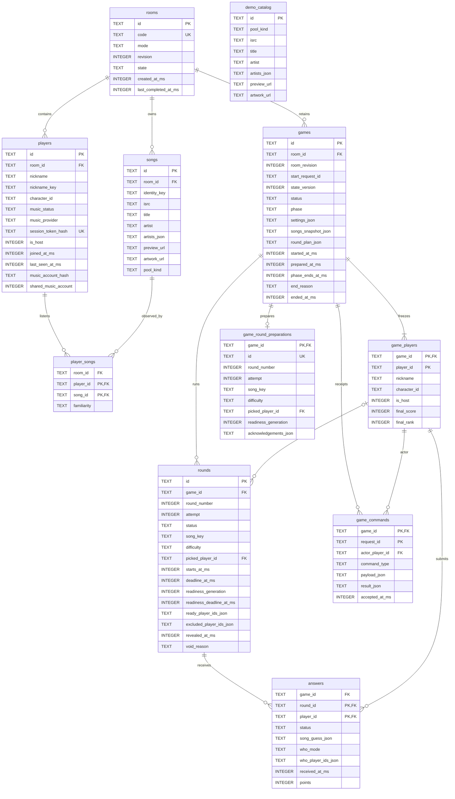
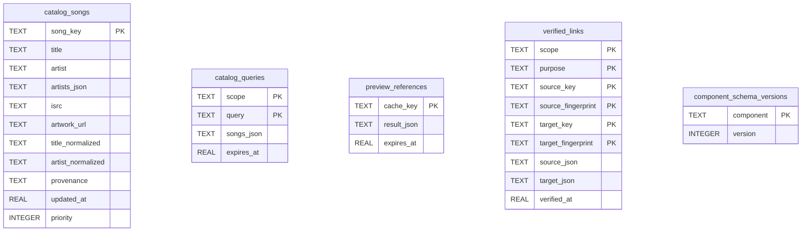

# 06 — Data Model

All persistence uses `DATA_DIR/whos_on_repeat.sqlite3` (default `data/whos_on_repeat.sqlite3`). Rooms, Game and the public catalog own separate table groups. [Application migrations 001–006](../backend/storage/migrations/) set `PRAGMA user_version=6`; catalog initialization tracks version 3 separately in `component_schema_versions` through [store.py](../backend/catalog/store.py) and [links.py](../backend/catalog/links.py).

Connections use WAL, foreign keys and bounded busy timeouts. SQLite JSON and FTS5 support are required.

## Rooms and Game tables

JSON columns store validated values as SQLite `TEXT`; `_ms` timestamps are UTC milliseconds. Composite foreign keys enforce room/game scope.

Rooms owns `rooms`, `players`, `songs`, `player_songs` and `demo_catalog`. Game owns `games`, `game_players`, `rounds`, `game_round_preparations`, `answers` and `game_commands`. `games.room_id` restricts room deletion until game history is removed.

`game_players.player_id` freezes player identity independently of live membership. `rounds.song_key` points into the frozen game snapshot. Demo assignment copies lookup songs into room storage. These snapshots preserve matches and results across membership changes and catalog reseeding.

## Keys, constraints and private state

| Table | Additional scope/uniqueness and behavior |
|---|---|
| `rooms` | Unique six-character code; `mode` is `normal / demo`, `state` is `lobby / playing` |
| `players` | Unique `(room_id,id)` and normalized nickname per room; at most one host; credential digest unique; account uniqueness applies only where `shared_music_account=0` |
| `songs` | Unique `(room_id,id)` and `(room_id,identity_key)`; `pool_kind` is `personal / decoy`; nullable preview retains unavailable observed ownership |
| `player_songs` | PK `(player_id,song_id)`; composite FKs to `(room_id,id)` in both players and songs; familiarity is `easy / medium / hard` |
| `demo_catalog` | Stable unique fixture ID; `personal / decoy`; selected local-pack preview URL validated before reseeding |
| `games` | Unique `(room_id,start_request_id)`; one preparing/playing game per room; status/phase checks; frozen settings/song data plus mutable checked plan |
| `game_players` | PK `(game_id,player_id)`; at most one frozen host; final score/rank stored on completion or labelled abort |
| `rounds` | Unique `(game_id,id)`, `(game_id,round_number,attempt)` and `(game_id,song_key)`; at most one ready/playing attempt per game; original slot `1–15`, attempt `1–4` |
| `game_round_preparations` | At most one upcoming candidate per game; unique preparation ID; game-scoped picked-player FK; renewable acknowledgements stay separate from active scored attempts and are consumed at promotion or removed on finish |
| `answers` | PK `(round_id,player_id)`; composite game-scoped FKs to rounds and frozen roster; one final answer per attempt/player |
| `game_commands` | PK `(game_id,request_id)`; actor constrained to frozen roster; accepted payload/result retained for idempotent command retries |

Round status is `ready|playing|revealed|void`; difficulty is `easy|medium|hard|decoy`. A decoy has no picked player. Readiness generation starts at one, and a Retry increments it without creating a new song attempt. Exclusions change only the current barrier. Revealed rounds have a reveal timestamp; void rounds have a cause and do not contribute points.

A submitted answer contains the signed selection's authenticated song facts or JSON `null`, the selected frozen player IDs, acceptance time and eventual points. `who_mode=nobody` is an explicit submitted empty selection. A missing answer has `status=missing`, `who_mode=blank`, null receipt/song guess and zero points. Their distinction survives persistence and reveal projections. Other players' answer facts remain private; each response contains only the caller's answer.

Room credentials are stored as `session_token_hash`. Personal music accounts use a digest of `room_id:provider:account_id`; provider tokens stay outside SQLite. `shared_music_account=1` marks explicit playtest admissions that can share an account. Demo stores neither a personal provider nor an account digest. `character_id` stores a supported blob color.

Checked imports provide media. Observations preserve ownership with preview URLs stripped; compatible checked imports can later add playable audio. [Architecture](05_ARCHITECTURE.md#music-admission-and-the-public-catalog) describes this boundary.

## Public catalog and operational tables

Public tables store metadata and caches independently of private room/listener state. Catalog timestamps and expiry use Unix-second `REAL` values.

`catalog_fts` indexes `title_normalized` and `artist_normalized` from `catalog_songs`, linked by SQLite `rowid`. Insert/update/delete triggers keep the FTS5 index synchronized.

Verified links use the six-column composite primary key shown above and retain source/target metadata snapshots. `scope` identifies provider/storefront; `purpose` distinguishes guess selection from recording resolution. Successful links are saved in both directions. Fingerprints include version-aware title, credited artist identities, ISRC and matching-rule version. Positive links persist while identity remains valid; query and preview expiry are separate.

## Initialization, retention and migration history

Startup applies migrations, checks foreign keys, reconciles interrupted games and initializes the public catalog. A valid installed Demo pack seeds `demo_catalog`; an absent pack disables Demo, and an existing invalid pack fails validation before initialization. The public MusicBrainz starter seeds an empty catalog. Full metadata import is an optional offline tool.

Demo reseeding replaces the lookup while preserving room copies and frozen games. Media installation and provenance are documented in [catalog setup](../catalog/README.md).

Retention is thirty days from room creation or the last completed game. Cleanup deletes Game history before Rooms rows in one transaction. Shared public metadata and verified links remain. [Game Rules](03_GAME_RULES.md#8-leaderboard) defines results and retention behavior.

| Migration | Retained purpose |
|---|---|
| `001_initial.sql` | Rooms/Game initial tables and JSON constraints |
| `002_song_selections.sql` | Replace option-slot answers with frozen selected-song facts, preserving historical points/results |
| `003_blob_colors.sql` | Translate cosmetic character IDs to current colors |
| `004_music_admission.sql` | Account digest/uniqueness and personal/decoy pool kind |
| `005_playtest.sql` | Explicit shared-account exemption for playtest rows |
| `006_round_preparation.sql` | Separate next-round candidate and renewable preparation acknowledgements |
| Catalog component v3 | Permanent scoped verified links and source/target snapshots; migrate older successful selections |

Historical option-answer and `catalog_selections` structures are migration inputs. Current answers store selected-song facts; permanent links live in `verified_links`. Migration/restart tests and `PRAGMA foreign_key_check` verify these relationships.
